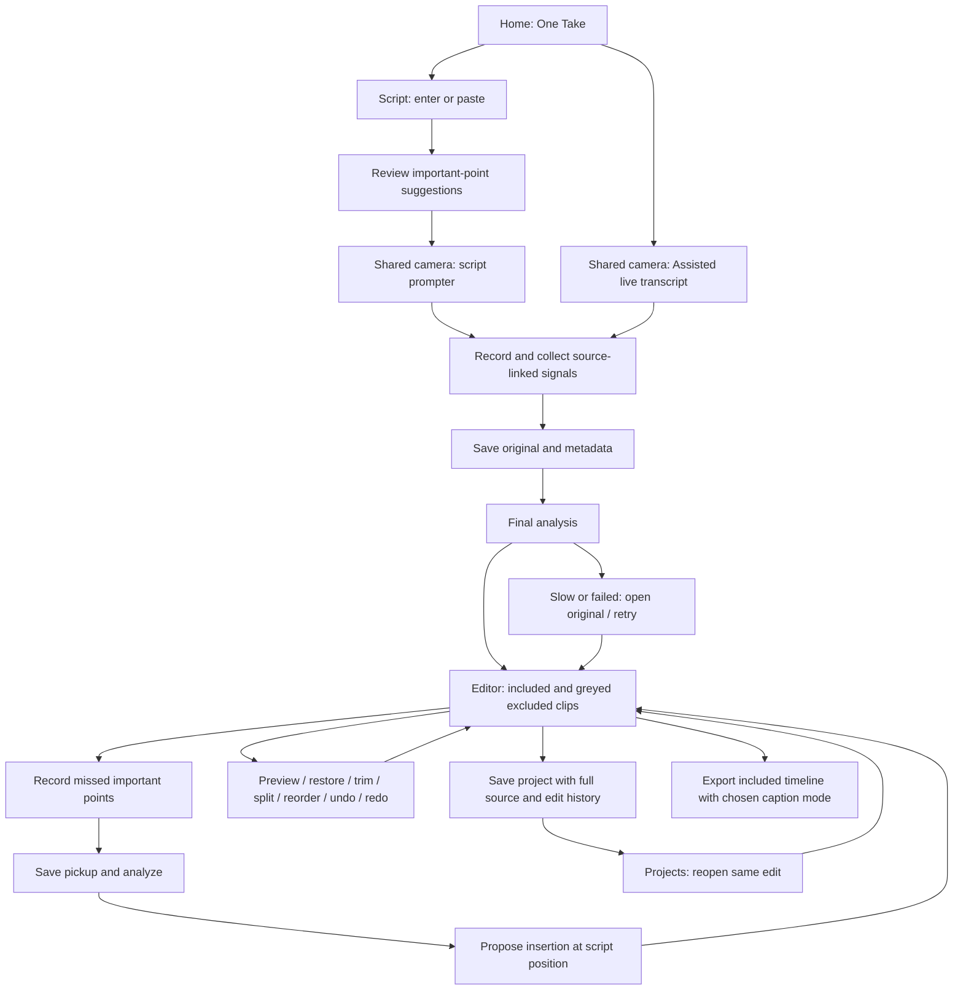

# One Take V1 — product specification and T1.5 gap map

Source: creator-provided Product & UX Specification and follow-up decisions on 2026-09-13. All newly identified gaps, including voice-following #61, are scheduled in **T1.5**. This document records planned behavior, not a claim that the phone build implements it.

Canonical shared specification: [T1.5 tracker #62](https://github.com/AlwinSunil/one-take-expo/issues/62). [Milestone](https://github.com/AlwinSunil/one-take-expo/milestone/5). Local acceptance checklist: [T1.5 validation](validation/T1.5.md).

## Comparison with the current app

Source audit: local `main` at `11f4455`. Existing issue states are not proof of device acceptance. Historical tests/evidence remain in their existing reports; this planning task ran no new app tests.

| User specification | Existing implementation / foundation | Missing or changed behavior | Planned delivery |
|---|---|---|---|
| 1. Home and mode selection | `src/app/index.tsx` has Script/Assisted and Projects; `script.tsx` has Paste from Clipboard | Carry both flows through final analysis/editor/export; English-only V1 copy and complete UX acceptance | #62 gate, #12/#29 baseline |
| 2. Shared camera and session state | Both modes reuse `camera.tsx`; recording controls, duration, captions and durable media exist | Complete durable speech/silence/filler/repeat/gaze/progress signals; distinguish unavailable from no events | #65, #66, #64 |
| 3. Script teleprompter | Current/next text, manual arrows/remote and conservative whole-token matching exist | Meaning-preserving fuzzy alignment, automatic advancement, speech/manual skip and reanchor, retained skipped/mismatched/repeated states | #61 (moved to T1.5), extends #16/#19/#26 |
| Important-point follow-up | Manual script/actions and targeted pickups exist | AI suggests important points; user can adjust them; detect missed ideas and insert later pickups in the correct script position | #63 |
| 4. Assisted Mode | Shared camera with live STT and later transcript review exists | Complete both-mode signal collection and automatic final analysis; no script prerequisite | #66/#65, reuses #13/#24/#29 |
| 5. Repeated takes | Take ledger/selection exists; `buildReviewSuggestions` compares adjacent equal normalized utterances | Group partial and non-adjacent related attempts; recommend strongest complete take with reasons, preserving all alternatives | #66, reuses #16/#22/#24 |
| 6. Eye contact and speech signals | Vision exposes face presence; `SessionState` declares some signal fields | Face presence is not gaze. Implement approximate 1 Hz labels, explicit unknowns and durable source-linked observations | #64/#65/#66 |
| 7. Visual Suggestions | Suggestions surface and enabled vision/coach plumbing exist | Strict tap-triggered bounded suggestion job, separate from gaze sampling; actionable supported categories and honest unavailable states | #69, reuses #18/#28 |
| 8. Stop and analysis | Raw checkpoint/save before caption finalization, derived coverage and direct editor return exist; saved-audio recheck is available manually | Visible recoverable final-analysis lifecycle and ranked recommendation proposal in both modes without blocking saved-original access | #66/#65, preserves #17 playback |
| 9. Editor | Filmstrip trim, take choices, prepared sequences and limited decision undo exist | Clip split/delete/reorder and multi-step redo/history; greyed excluded portions directly in timeline, preview/restore and direct Save | #67, extends #30 |
| 10. Captions | Transcript corrections and rendered captions exist; original versus trim/cut export affects caption behavior | Independent editor visibility and burn-in settings on the same edited timeline, persisted per project | #68 |
| 11. Projects | Versioned Project, source recordings, transcript/takes, review segments, storage/pickup recovery exist | Full extensible observation/analysis history, important-point IDs, general timeline history and caption configuration | #65, extends #14 |
| 12. Export | Native Media3 multi-source caption export, gallery/share and recoverable jobs exist | General user clip order/exclusions and caption toggle parity; empty timeline must not become raw export | #67/#68, extends #21 |

## Product decisions that replace or sharpen earlier scope

- **T1.5 owns all additions here.** Existing T0/T1 issues remain foundations with follow-up links. #61 moves from T1 to T1.5. No issue is marked implemented by this comparison.
- **Ordinary scripts accept paraphrases.** The existing `matchTranscriptToScript` only accepts equal canonical token sequences; the proposed behavior is a real change, not merely a label. #61 covers full-script alignment; T2 #32 remains the separate outline/talking-points workflow. Importance and optional exact-word must-say (#23) are independent.
- **Important points are suggestions the creator controls.** AI identifies script-backed ideas, does not invent obligations, and preserves user overrides. Uncertain speech evidence stays unresolved. The missed-point flow reuses existing pickup capture/storage and adds automatic editable insertion at the intended script position.
- **Save originals before analysis.** A short visible analysis stage is allowed; slow/failed analysis exposes the editor with the original or available partial proposal. Final analysis does not require T2's optional larger-model caption refinement (#33).
- **Exclusions remain directly visible.** Filler, silence, weaker-take and manual exclusions appear greyed in the editor with reason, source preview and Restore. They contribute no playback duration or frames to the final edit. Save is available without mandatory per-clip review; the project retains source/history and the video contains only included clips.
- **Strongest does not necessarily mean latest.** Final ranking must consider supported completeness/adherence/delivery evidence, explain its choices and keep all takes. Unknown gaze or a meaningful pause cannot automatically invalidate speech.
- **Tap-only scene suggestions; separate gaze sampling.** Turning a continuous coach's panel on/off is insufficient. Optional recording-time gaze observations do not authorize unsolicited scene analysis or coaching.
- **Non-destructive editing is distinct from deleting a project.** Clip Delete is reversible exclusion. No analysis/edit/save/export mutates the original. Existing #27 remains a separate, explicit permanent project deletion flow.

## Source evidence inspected

- `src/app/index.tsx`, `src/app/script.tsx`: current entry, paste and script flow.
- `src/app/camera.tsx`, `src/hooks/use-live-captions.ts`: manual prompter index, STT/session handling, raw checkpoint/finalization and camera flow.
- `src/features/vision/use-vision.ts`: current face/vision interface; no verified eye-contact contract.
- `src/lib/transcript-workflow.ts`: whole-canonical-token script matching, conservative take ledger, exact adjacent repeat suggestions.
- `src/lib/session.ts`, `src/lib/project-workflow.ts`: current session declarations, persisted Project fields and refinement behavior. Declared fields alone are not evidence of collected/persisted signals.
- `src/app/editor.tsx`, `src/components/review/transcript-review.tsx`, `src/components/review/export-controls.tsx`, `src/lib/review-export-selection.ts`: current trim/cut/review/caption/export paths.

## Implementation order and ownership

1. Agree stable source/script/point IDs, timestamps, observations, proposal/edit revisions and compatibility in #65. Producers can develop against shared fixtures before device wiring; references to producer issues are contract handoffs, not cyclic completion prerequisites.
2. Speech lane implements #61 and point/signal/repeat logic in #63/#66 against the existing STT. Capture lane implements #64 gaze and #69 tap-only suggestions against the existing frame owner.
3. Review/storage lane implements #67's general timeline/history and #68's caption settings, consuming versioned source/proposal contracts. Preview and export use the same user-edit snapshot.
4. Integrate #66's Stop-to-editor lifecycle and #63's capture → pickup → proposed insertion with camera and editor owners. Preserve manual edits under late analysis and pickup results.
5. Run the T1.5 acceptance matrix and relevant T0/T1 regressions on the integrated iQOO. Existing peer/device evidence cannot be inferred for new requirements.

Cross-feature ownership follows #1: Alwin capture/vision, Sabari speech/alignment/recommendations, Melvin storage/editor/export. Runtime/model choices are not expanded merely by writing an AI requirement; the current STT remains in use.

## UX state map

## Canonical feature and acceptance specification

Implement the creator-approved English-only V1 Product & UX Specification as a T1.5 increment over the existing app. This milestone collects the new gaps; existing T0/T1 implementations and acceptance history remain in their original issues. T2 talking points/multicam and richer T1 reframing are not prerequisites for this V1 slice.

## Product rules

- One Android camera/recorder is shared by Script and Assisted modes. Preserve the existing offline Moonshine STT and native capture/media stack.
- Original recordings are immutable during recording, analysis, editing and export. Timeline Delete is reversible exclusion. Permanently removing a project remains the separate, explicitly confirmed #27 action.
- AI output is a recommendation with evidence, not a destructive decision. Keep all alternatives and user overrides. Unknown/pending observations are not successful coverage.
- Normal script matching accepts meaning-preserving English paraphrases, including contractions and the provided One Take example. Protect changed facts, numbers, names and negation. User-selected must-say wording remains a separate opt-in requirement (#23).
- Visual Suggestions run only when tapped. Approximate 1 Hz gaze metadata during recording is a separate signal, not automatic gaze coaching or an exclusion rule.

## End-to-end UX

**Home:** One Take → Script Mode or Assisted Mode. V1 communicates English support without adding onboarding gates.

**Script:** enter/paste (Paste from Clipboard) → editable spoken sections and separate bracketed cues → review AI-suggested important points → Continue → shared Camera with approximately current/next text near the lens. Important points can be adjusted; uncertainty permits manual selection.

**Assisted:** Home → same Camera with live transcript. No script or prompter requirement.

**Record:** Record/Stop + duration; offline transcription and timestamped source-linked signals. Script voice-follow advances on sufficiently supported matches and can skip/reanchor; skipped content remains unresolved. Neither signals nor automated recommendations delete media.

**Stop:** Save complete original and available metadata first → visible final analysis → generate recommendation timeline → Editor. Slow/failed analysis offers Open editor with original/partial results and Retry; useful playback does not wait for export or larger-model refinement.

**Missed important points:** review missing points → record only chosen points through existing pickup capture → save pickup original → analyze → automatically propose insertion at intended script positions → preview/accept or undo/change. Example: first take A,C plus pickup B produces A,B,C. Preserve manual edit conflicts for explicit resolution.

**Editor:** familiar clip timeline; retained clips normal; excluded/deleted portions stay visible directly in the timeline as greyed clips with filler/silence/weaker-take/manual reasons. Tap a greyed clip to preview its source and Restore; greyed context does not contribute to final playback time. Trim, Split, Delete/exclude, Reorder, multi-step Undo/Redo. All AI choices can be overridden, all originals remain available. Save project and Export/Save video remain available here without requiring review of every exclusion. Saving commits the displayed edit while retaining greyed sections and history for later restoration. Save state and failures are visible; Projects resumes the same edit.

**Captions:** independent Show in editor and Burn into export settings, including fully off. Keep transcript and corrections regardless of visibility.

**Export:** render precisely the user-confirmed current timeline and chosen caption mode to a standalone video. Excluded clips never appear; an empty sequence cannot fall back to the raw original. Progress/cancel/retry, gallery and explicit share remain available.

## Implementation issues

| Capability | T1.5 issue | Reuse / related foundation |
|---|---|---|
| Fuzzy script alignment, voice follow and skipped-section recovery | #61 | #12, #13, #16, #19, #26 |
| AI important points and automatic missed-point pickup insertion | #63 | #20, #23, #31 |
| Approximate 1 Hz gaze metadata | #64 | #15 |
| Durable extensible signals, analysis and edit history | #65 | #14, #20, #27 |
| Both-mode signals, repeated takes and final recommendations | #66 | #13, #16, #17, #22, #24, #29 |
| Clip timeline and reversible user editing | #67 | #17, #20, #21, #30 |
| Caption visibility and burn-in controls | #68 | #21, #30 |
| Strictly tap-triggered Visual Suggestions | #69 | #18, #28 |

## Acceptance gate — docs/validation/T1.5.md

- [ ] Run both complete entry → recording → save/analysis → editor → reopen → export paths on integrated iQOO. Include clipboard/script edits, English copy, large text, accessible controls and Android back/cancel.
- [ ] Script example: “Today I am going to show you how One Take works.” matches “Today I'm going to show you how the One Take app works.” Similar text with changed meaning must not falsely cover it. Demonstrate skipping and returning without a stuck prompter.
- [ ] Confirm AI important points can be corrected; miss point B, record only B later, then inspect automatic A,B,C assembly, undo/override, caption alignment and reopened state. Repeat with reverse-order pickups and edited timeline conflicts.
- [ ] Five back-to-back clean/flub/repeat/partial/noisy sessions demonstrate stable voice follow, truthful point status, non-destructive recommendations and fallback. Report real speech accuracy, timings and unknown gaze states separately from fixtures.
- [ ] Demonstrate trim → split → delete → reorder → undo → redo → reopen → export and all-clips-excluded behavior; compare source hashes, output interval order, audio and captions. Test all four editor/export caption combinations.
- [ ] Verify approximately 1 Hz gaze provenance and unknown handling; verify no suggestion jobs before a tap, then bounded useful advice on demand in both modes.
- [ ] Exercise permissions, save failure/low storage, interruptions, analysis retry/cancel/process death, missing media and stale jobs/edits without losing originals or overwriting user decisions.
- [ ] Run relevant T0/T1 regressions; retain actual unrun or failed acceptance gates. Closed issues or passing fixtures do not prove new V1 requirements. Include ten-clap/long-recording A/V evidence where existing release gates require it.
- [ ] Feature owners supply device evidence; non-author reviewers reproduce the changed paths. Coordinate capture (Alwin), speech (Sabari) and storage/editor/export (Melvin) under #1. This tracker does not authorize unsolicited messages or claim their sign-off.

## Scope and delivery

This is backlog/spec integration, not an app implementation. No new recognizer/cloud service is selected. Matching and important-point extraction must be evaluated independently from STT. Optional T2 larger-model caption refinement (#33) remains separate from the required T1.5 final take analysis.
